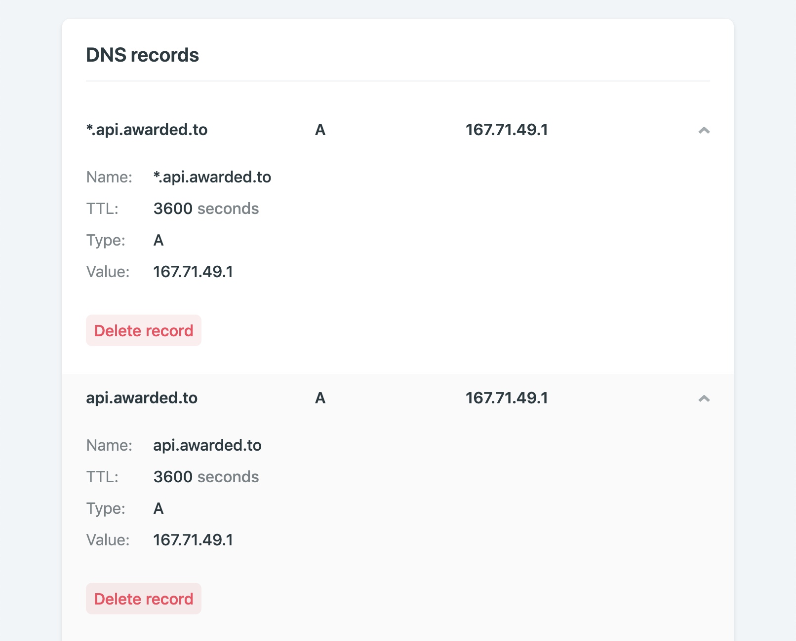

I recently moved all my apps from Heroku to a DigitalOcean droplet using Dokku. This centralized things and I saved me a bunch of money. Here is a recipe I follow for each new app to get it up-and-running.

For clarification, I am an amateur. I build apps for fun, and I am learning as I go. My advice might be flawed, but it works for me, and it might help you as well :)

However, first, a little background.

## What do I build?

My projects are all built on a Vue-based frontend (either using Vue-CLI, Nuxt, Vuepress, or Gridsome). When I need a database, I set up a Postgres instance with Postgraphile, which gives me a GraphQL endpoint in the backend. Just recently, I started exploring Strapi as an attractive CMS, which also uses Postgres as a database and delivers data to my frontend through a GraphQL endpoint. 

## Where do I host?

For all my frontend needs, Netlify is more than enough. It is free, easy to use, has excellent interface and usability. It is perfect for Vue-powered projects.

Unfortunately, Netlify won’t work for my backend projects which rely on Postgres. I tried many services but ended up choosing Dokku on DigitalOcean as the best solution all my backend needs. 

## What else have I tried?

Once you start using Postgres in the backend, there are two options: self-hosted or hosted database services. 

For a long time, I thought I had to avoid self-hosting (and self-maintaining) a Postgres database. Sharding? Replication? Backups and restores? Upgrades? It all used to give me chills. 

So I spent most of my early development days trying out hosted database services out there.

### Heroku

Yes, Heroku has a generous free tier with a free Postgres add-on. 

However, free comes to a cost when you realize you’ll cross some of its limits faster than you think. When you decide to fix all issues and upgrades your services, you are already paying much more than free.

### AWS RDS

I then moved to AWS RDS, creating a Postgres instance in a container. 

I thought I could host all my databases that for minimal cost, as they offered a very generous free tier. However, once the free tier ended, I was paying almost $50 a month for the database needs of my little side projects. This needed to change.

## Why Dokku on Digital Ocean?

After a while paying the bill, I realized I was (insert metaphor). Of course, there are advantages of hosted database solutions. However, for the scale of my side projects, I need very little. After all, if something goes wrong and my apps go offline,  I can restore them from backups and get them running again.

Therefore, my requirements were simple:

- Scheduled DB backups
- Easy Git deployments
- Low price

That is where Dokku comes into play. It is just like Heroku, but without the pretty UI. You have to host it on your droplet, and it is all command-line-based. 

However, it offers it all: you can easily create apps, add domains, set variables, add Postgres databases, set up scheduled backups, and deploy via git. 

All in one little Digital Ocean droplet costing me 5USD/month.

## What’s my process?

Every time I start a new app, I follow a series of steps which make the whole process very simple. This recipe assumes:

- You already have a DO droplet with Dokku installed. If not, [follow this tutorial](https://github.com/dokku/dokku/blob/master/docs/getting-started/install/digitalocean.md)
- You already ensured the safety of your droplet, removing root login and creating a new user who can login via SSH. If not, [follow this tutorial](https://www.digitalocean.com/community/tutorials/initial-server-setup-with-ubuntu-16-04)
- You logged into your droplet via SSH

### Create the app

You can use Dokku by typing `dokku` followed by the command and other options. Type `dokku help` to see a list of all commands:

```shell
~ dokku help
Usage: dokku [--quiet|--trace|--rm-container|--rm|--force] COMMAND <app> [command-specific-options]

Primary help options, type “dokku COMMAND:help” for more details, or dokku help --all to see all commands.

Commands:

    apps                     Manage Dokku apps
    buildpacks               Manages buildpack settings for an app
    certs                    Manage Dokku apps SSL (TLS) certs
    checks                   Manage zero-downtime settings
    config                   Manages global and app-specific config vars
    docker-options           Pass options to Docker the various stages of an app
    domains                  Manage vhost domains used by the Dokku proxy
    enter                    Connect to a specific app container
    events                   Show the last events (-t follows)
    git                      Manages the git integration for an app
    help                     Print the list of commands
    logs                     Output app logs
    network                  Manages network settings for an app
    nginx                    Interact with Dokku’s Nginx proxy
    proxy                    Manage the proxy used by dokku on a per app
```

As you can see, you can also type `dokku COMMAND:help` for further help on specific commands. As we want to create an app, let’s check how to use the `apps` command:

```shell
~ dokku apps:help
Usage: dokku apps[:COMMAND]
Manage Dokku apps

Example:
$ dokku apps:list
=====> My Apps
example
example2

Additional commands:
    apps                              [DEPRECATED] Alias for apps:list
    apps:clone <old-app> <new-app>    Clones an app
    apps:create <app>                 Create a new app
    apps:destroy <app>                Permanently destroy an app
    apps:exists <app>                 Checks if an app exists
    apps:list                         List your apps
    apps:lock <app>                   Locks an app for deployment
    apps:locked <app>                 Checks if an app is locked for deployment
    apps:rename <old-app> <new-app>   Rename an app
    apps:report [<app>] [<flag>]      Display report about an app
    apps:unlock <app>                 Unlocks an app for deployment
```

Easy to figure out what to do next, right?

```shell
~ dokku apps:create appname
-----> Creating appname... done
```

You can, of course, use any name you want. It is the same as creating a new app in Heroku. It also gives you a remote git repository which you can add to your local app:

```shell
git remote add dokku dokku@<droplet-ip>:appname
```

Add the droplet IP in the command above before adding. I am assuming you already use git to deploy apps, so I will not get much into detail on that. If not, check this tutorial.

### Add a domain

I always like to have my backend hosted on a subdomain of my apps. For example, if my app is at [awarded.to](https://awarded.to), I want its API endpoint to be at *api.awarded.to*. 

You do not need to do this (you can always access your app using the droplet’s IP address), but it makes it all clean and friendly. It also helps when you have several apps in the same droplet. Moreover, it is straightforward to do:

First, you need to modify your domain’s DNS settings. You’ll need to add an *A record* named after your subdomain and pointing to the droplet’s IP address. On Netlify, it looks like this:



The instructions for your registrar might differ. Just search its docs for *add DNS subdomain* and you should find answers quick.

Now back on Dokku, you’ll add the subdomain to your app. For that, type:

```shell
~ dokku domains:add appname domain
```

The domain should be without the `http` protocol (just *api.awarded.to* instead of *https://api.awarded.to*).

To keep it all safe and secure, you should also enforce `https` on your endpoint. This article walks you through the steps necessary to ensure encryption when accessing your backend endpoint:

[Effortlessly add HTTPS to Dokku, with Let’s Encrypt](https://medium.com/@pimterry/effortlessly-add-https-to-dokku-with-lets-encrypt-900696366890)


### Add Postgres

As in Heroku, adding a Postgres service to your app is pretty simple. First, you create a new database:

```shell
~ dokku postgres:create dbname

# Then link it to your app
~ dokku postgres:link appname dbname
```

That’s it. It creates an environment variable called DATABASE_URL with your database address. If your app is configured to access the database via this environment variable, you are good to go. Otherwise, you can set other variables as necessary, based on this value.

You should also set up automatic backups on your database. I usually set up a cron job to create a database dump every day, and upload it to an AWS S3 bucket. 

For that, you’ll first need both an S3 bucket and an IAM user with the appropriate permissions. Create a bucket on S3 and a user on AWS IAM with the following policy:

```json
{
    "Version": "2012-10-17",
    "Statement": [
        {
            "Action": [
                "s3:ListAllMyBuckets",
                "s3:GetBucketLocation"
            ],
            "Effect": "Allow",
            "Resource": [
                "arn:aws:s3:::*"
            ]
        },
        {
            "Effect": "Allow",
            "Action": "s3:*",
            "Resource": [
                "arn:aws:s3:::lutasanticapital/*",
                "arn:aws:s3:::lutasanticapital"
            ]
        }
    ]
}
```

Copy its credentials (Access Key ID and Secret access key), which you’ll use to configure the backups on Dokku:

```shell
# setup s3 backup authentication
dokku postgres:backup-auth dbname AWS_ACCESS_KEY_ID AWS_SECRET_ACCESS_KEY

# backup the `appname` service to the `BUCKET_NAME` bucket on AWS
dokku postgres:backup appname BUCKET_NAME

# schedule a backup
# CRON_SCHEDULE is a crontab expression, eg. "0 3 * * *" for each day at 3am
dokku postgres:backup-schedule appname CRON_SCHEDULE BUCKET_NAME
```


## Deploy and enjoy

That is pretty much it. If your app is not overly complicated, it should be working right after the first git push to the dokku remote:

```
~ git push dokku master
```

Keep an eye on the log to see if the app deployed correctly and to correct any error that may arise. 

Your app should then be live on your chosen domain, just waiting for your frontend to connect!

## Help me to improve it

Let me know if you have any questions.

As I wrote earlier, I am an amateur. Please, if you see mistakes or opportunities for improvement, let me know! I am always happy to learn how to make things better.
